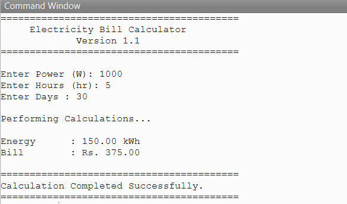

# ⚡ Electricity Bill Calculator

A GNU Octave-based application that calculates electrical energy consumption and estimates the electricity bill based on predefined tariff slabs. This project demonstrates modular programming, function creation, user input handling, and conditional statements (`if-elseif-else`).

---

## 📌 Features

- Calculates electrical energy consumption (kWh)
- Estimates electricity bill based on tariff slabs
- Uses modular programming with separate function files
- Interactive user input
- Displays formatted output

---

## 📂 Project Structure

```
02_Electrical_Bill_Calculator
│
├── README.md
├── main.m
├── calculateEnergy.m
├── calculateBill.m
└── output.png
```

---

## ⚙️ Formula Used

### Energy Consumption

```
Energy (kWh) = (Power × Hours × Days) / 1000
```

where:

- **Power** = Power rating (W)
- **Hours** = Operating hours per day
- **Days** = Number of operating days

### Electricity Bill

```
Bill = Energy × Rate
```

---

## ⚡ Tariff Structure

The electricity bill is calculated using the following tariff rates:

| Energy Consumption (kWh) | Rate (Rs./Unit) |
|--------------------------:|----------------:|
| 0 – 100                   | 1.50            |
| 101 – 200                 | 2.50            |
| 201 – 300                 | 4.00            |
| Above 300                 | 6.00            |

> **Note:** This project uses a simplified tariff model where the entire energy consumption is billed at the rate corresponding to its tariff slab.

---

## ▶️ Sample Input

```
Power (W): 1000
Hours: 5
Days: 30
```

---

## 📊 Sample Output

```
=========================================
     Electricity Bill Calculator
             Version 1.1
=========================================

Enter Power (W): 1000
Enter Hours (hr): 5
Enter Days : 30

Performing Calculations...

Energy      : 150.00 kWh
Bill        : Rs. 375.00

=========================================
Calculation Completed Successfully.
=========================================
```

---

## 💻 Technologies Used

- GNU Octave
- Modular Programming
- Conditional Statements (`if-elseif-else`)

---

## 📷 Program Output

Add your program screenshot as **output.png**.

```markdown

```

---

## 👩‍💻 Author

**Thota Sadhika**

Electrical & Electronics Engineering (EEE)
