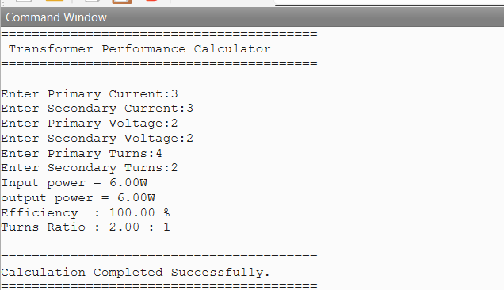

# Transformer Performance Calculator

A GNU Octave project that calculates the **Input Power**, **Output Power**, **Transformer Efficiency**, and **Turns Ratio** of an ideal transformer using modular programming.

---

## 📌 Project Description

This project is developed using **GNU Octave** to demonstrate basic transformer performance calculations. The program accepts user inputs for primary and secondary voltages, currents, and turns, then computes:

- Input Power
- Output Power
- Transformer Efficiency
- Turns Ratio

The project is implemented using separate user-defined functions to promote modular and reusable code.

---

## ✨ Features

- Calculates Input Power
- Calculates Output Power
- Calculates Transformer Efficiency
- Calculates Transformer Turns Ratio
- Modular programming using functions
- Simple command-line interface
- Well-formatted output

---

## 📐 Formulae Used

### Input Power

\[
P_{in}=V_p \times I_p
\]

### Output Power

\[
P_{out}=V_s \times I_s
\]

### Transformer Efficiency

\[
\eta=\frac{P_{out}}{P_{in}}\times100
\]

### Turns Ratio

\[
\text{Turns Ratio}=\frac{N_p}{N_s}
\]

---

## 📂 Project Structure

```
03_Transformer_Performance_Calculator
│
├── main.m
├── calculatePower.m
├── calculateEfficiency.m
├── calculateTurnsRatio.m
├── output.png
└── README.md
```

---

## ▶️ How to Run

1. Open the project folder in GNU Octave.
2. Make sure all `.m` files are in the same directory.
3. Run:

```octave
main
```

4. Enter the required values when prompted.
5. View the calculated results.

---

## 💻 Sample Output

```text
=========================================
 Transformer Performance Calculator
=========================================

Enter Primary Current: 3
Enter Secondary Current: 3
Enter Primary Voltage: 2
Enter Secondary Voltage: 2
Enter Primary Turns: 4
Enter Secondary Turns: 2

Input Power   : 6.00 W
Output Power  : 6.00 W
Efficiency    : 100.00 %
Turns Ratio   : 2.00 : 1

=========================================
Calculation Completed Successfully.
=========================================
```

---
## 📷 Program Output





---

## 🛠 Technologies Used

- GNU Octave
- MATLAB Syntax
- Electrical Engineering Fundamentals

---

## 📚 Concepts Covered

- Transformer Basics
- Electrical Power Calculation
- Transformer Efficiency
- Turns Ratio
- Function Programming
- Modular Programming
- User Input and Output Formatting

---

## 👩‍💻 Author

**Thota Sadhika**

Electrical & Electronics Engineering Student

GitHub: https://github.com/chick321-prog
